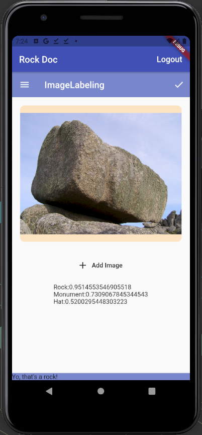

# Rock Doctor

## Overview

This is an android image recognition and labeling application that runs from Google Firebase's ML Kit.  It is designed for the user to upload or take photographs of anything and the application will tell the user if it is a rock or not.  The application runs on the Firebase ML Kit object labeling API and it will tell the user several other objects that are detected in the photo and the confidence in the decision.  The application also utilizes Firebase's Authentication API.  A notification is displayed if a rock is detected in the photograph.

## Future Improvments
* Build for IOS.
* Image picker package from flutter throws an error on older android phones (android 9 or less).
* Error handling in general needs to be improved.
* Add email and password authentication.
